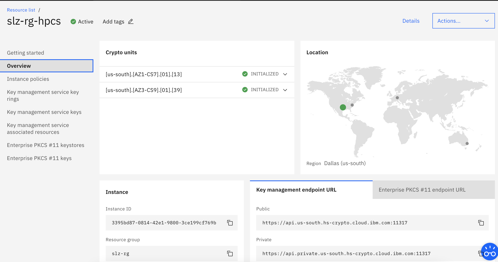

# Terraform module for auto initialization of a HPCS instance

This module initializes a zeroized HPCS instance.

## Terraform versions

Terraform 0.13.

## Prerequisite

* python version 3.5 and above: [Installation instructions](https://www.python.org/downloads/)
* pip version 3 and above

```bash
  python3 -m pip --version
```

* Install pexpect as per instructions [here](https://pexpect.readthedocs.io/en/stable/install.html)

```bash
  pip3 install pexpect
```

`ibm-cos-sdk` package is required if initialisation is performed using objeck storage example..

```bash
  pip3 install ibm-cos-sdk
```

* Login to IBM Cloud Account using cli

```bash
ibmcloud login --apikey `<XXXYourAPIKEYXXXXX>` -r `<region>` -g `<resource_group>`
```

* Generate oauth-tokens `ibmcloud iam oauth-tokens`. This step should be done as and when token expires. 

* To install tke plugin `ibmcloud plugin install tke`. Find more info on tke plugin [here](https://cloud.ibm.com/docs/hs-crypto?topic=hs-crypto-initialize-hsm#initialize-crypto-prerequisites)

* To run locally consider to create virtual environmet as:

```bash
pip3 install virtualenv
virtualenv venv
virtualenv venv --system-site-packages
source venv/bin/activate
```

## Assumptions to initialize HPCS instance by provided Terraform automation

* To initialize the HPCS instance using the HPCS init module, it is assume that the HPCS instance is being initialized first time after creating the HPCS instance.
* There are no administrators added and no key signatures created.
* If the HPCS instance was initialized first with script / manually then this auto-init script would not able to initialize the HPCS instance, in this case user would able to run initilaization commands manually.

## Notes On Initialization

* The current script adds two signature key admins.
* The admin details can be provided in in variables.tf file.

## Example usage

* Creating COS bucket is not the part of this Terraform module, but for uploading the signed keys need to create COS bucket as instructed [here](https://cloud.ibm.com/docs/cloud-object-storage?topic=cloud-object-storage-provision#provision-instance).

* Copy the module decleration from [here](./test/stages/stage0.tf) to the main.tf and variables with their values as in [variable example](./test/stages/variables.tf) variables.tf files and run the terraform.

```bash
  terraform validate
  terraform init
  terraform plan
  terraform apply
```

## Module and their required input variable details

### Initialise HPCS instance

```terraform

module "hpcs_init" {
  initialize          = var.initialize
  source              = "git::ssh://git@github.com/slzone/terraform-ibm-hpcs-initialisation"
  hpcs_instance_guid  = var.hpcs_instance_guid
  tke_files_path      = var.tke_files_path
  admin1_name         = var.admin1_name
  admin1_password     = var.admin1_password
  admin2_name         = var.admin2_name
  admin2_password     = var.admin2_password
  admin_num           = var.admin_num
  threshold_value     = var.threshold_value
  rev_threshold_value = var.rev_threshold_value
}

```

### Inputs

| Name              | Description                                                             | Type     | Required |
|-------------------|-------------------------------------------------------------------------|----------|----------|
| initialize        | Flag indicating that if user want to initialize the hpcs.               | `bool`   | Yes      |
| hpcs_instance_guid| HPCS instance GUID.                                                     | `string` | Yes      |
| tke_files_path    | Path to which tke files has to be exported.                             | `string` | Yes      |
| admin1_name       | First admin name.                                                       | `string` | Yes      |
| admin1_password   | First admin password.                                                   | `string` | Yes      |
| admin2_name       | Second admin name.                                                      | `string` | Yes      |
| admin2_password   | Second admin password.                                                  | `string` | Yes      |
| admin_num         | Number of admins.                                                       | `number` | Yes      |
| threshold_value   | Threshold value.                                                        | `number` | Yes      |
| rev_threshold_value   | Remove / delete threshold value.                                    | `number` | Yes      |

### Upload TKE Files to COS

```terraform
module "upload_to_cos" {
  source             = "git::ssh://git@github.com/slzone/terraform-ibm-hpcs-initialisation.git//modules/upload-to-cos"
  depends_on         = [module.hpcs_init]
  api_key            = var.api_key
  cos_crn            = var.cos_crn
  endpoint           = var.endpoint
  bucket_name        = var.bucket_name
  tke_files_path     = var.tke_files_path
  hpcs_instance_guid = var.hpcs_instance_guid
}
```

## Validation Steps

* HPCS initialization: HPCS initialization can be validated by running following command and should be able provide the details as bellow.

```hcl
==> ibmcloud tke cryptounit-add

API endpoint:     https://cloud.ibm.com
Region:           us-south
User:             
Account:          Public Cloud Customer Success/Austin/IBM's Account (ad5d072102214f4395eab22f03bbb2f9)
Resource group:   slz-rg

SERVICE INSTANCE: 3395bd87-0814-42e1-9800-3ce199cf769b
CRYPTO UNIT NUM   SELECTED   TYPE          LOCATION   
1                 false      OPERATIONAL   [us-south].[AZ1-CS7].[01].[13]   
2                 false      OPERATIONAL   [us-south].[AZ3-CS9].[01].[39]   
3                 false      RECOVERY      [us-south].[AZ3-CS9].[01].[38]   
4                 false      RECOVERY      [us-east].[AZ3-CS3].[01].[12]   

SERVICE INSTANCE: 40c0734c-0c17-42fe-b7bb-a86cf9755bd1
CRYPTO UNIT NUM   SELECTED   TYPE          LOCATION   
5                 false      OPERATIONAL   [us-south].[AZ3-CS9].[01].[37]   
6                 false      OPERATIONAL   [us-south].[AZ1-CS7].[01].[11]   
7                 false      RECOVERY      [us-south].[AZ1-CS1].[02].[09]   
8                 false      RECOVERY      [us-east].[AZ2-CS2].[01].[13]   

SERVICE INSTANCE: 58e67e85-ec9a-474e-bcd5-aad02a1af487
CRYPTO UNIT NUM   SELECTED   TYPE          LOCATION   
9                 false      OPERATIONAL   [us-south].[AZ2-CS8].[01].[24]   
10                false      OPERATIONAL   [us-south].[AZ3-CS3].[03].[03]   
11                false      RECOVERY      [us-south].[AZ2-CS8].[01].[23]   
12                false      RECOVERY      [us-east].[AZ1-CS1].[03].[05]   

Note: all operational crypto units in a service instance must be configured the same.
Use 'ibmcloud tke cryptounit-compare' to check how crypto units are configured.

Enter a list of CRYPTO UNIT NUM to add, separated by spaces:
> 1 2 3 4
OK

API endpoint:     https://cloud.ibm.com
Region:           us-south
User:             
Account:          Public Cloud Customer Success/Austin/IBM's Account (ad5d072102214f4395eab22f03bbb2f9)
Resource group:   slz-rg

SERVICE INSTANCE: 3395bd87-0814-42e1-9800-3ce199cf769b
CRYPTO UNIT NUM   SELECTED   TYPE          LOCATION   
1                 true       OPERATIONAL   [us-south].[AZ1-CS7].[01].[13]   
2                 true       OPERATIONAL   [us-south].[AZ3-CS9].[01].[39]   
3                 true       RECOVERY      [us-south].[AZ3-CS9].[01].[38]   
4                 true       RECOVERY      [us-east].[AZ3-CS3].[01].[12]   

SERVICE INSTANCE: 40c0734c-0c17-42fe-b7bb-a86cf9755bd1
CRYPTO UNIT NUM   SELECTED   TYPE          LOCATION   
5                 false      OPERATIONAL   [us-south].[AZ3-CS9].[01].[37]   
6                 false      OPERATIONAL   [us-south].[AZ1-CS7].[01].[11]   
7                 false      RECOVERY      [us-south].[AZ1-CS1].[02].[09]   
8                 false      RECOVERY      [us-east].[AZ2-CS2].[01].[13]   

SERVICE INSTANCE: 58e67e85-ec9a-474e-bcd5-aad02a1af487
CRYPTO UNIT NUM   SELECTED   TYPE          LOCATION   
9                 false      OPERATIONAL   [us-south].[AZ2-CS8].[01].[24]   
10                false      OPERATIONAL   [us-south].[AZ3-CS3].[03].[03]   
11                false      RECOVERY      [us-south].[AZ2-CS8].[01].[23]   
12                false      RECOVERY      [us-east].[AZ1-CS1].[03].[05]   

Note: all operational crypto units in a service instance must be configured the same.
Use 'ibmcloud tke cryptounit-compare' to check how crypto units are configured.

==> ibmcloud tke cryptounit-compare

SIGNATURE THRESHOLDS
SERVICE INSTANCE: 3395bd87-0814-42e1-9800-3ce199cf769b
CRYPTO UNIT NUM   SIGNATURE THRESHOLD   REVOCATION THRESHOLD   
1                 2                     2   
2                 2                     2   
3*                2                     2   
4*                2                     2   

* Indicates a recovery crypto unit used only to hold a backup master key value.

==> Crypto units with a signature threshold of 0 are in IMPRINT MODE. <==


CRYPTO UNIT ADMINISTRATORS
SERVICE INSTANCE: 3395bd87-0814-42e1-9800-3ce199cf769b
CRYPTO UNIT NUM   ADMIN NAME   SUBJECT KEY IDENTIFIER   
1                 admin1       2ce6f22b1d965eb480b1646bdd1886...   
                  admin2       232cbaf94ecf66680af5d2f7eab212...   
2                 admin1       2ce6f22b1d965eb480b1646bdd1886...   
                  admin2       232cbaf94ecf66680af5d2f7eab212...   
3*                admin1       2ce6f22b1d965eb480b1646bdd1886...   
                  admin2       232cbaf94ecf66680af5d2f7eab212...   
4*                admin1       2ce6f22b1d965eb480b1646bdd1886...   
                  admin2       232cbaf94ecf66680af5d2f7eab212...   

* Indicates a recovery crypto unit used only to hold a backup master key value.


NEW MASTER KEY REGISTER
SERVICE INSTANCE: 3395bd87-0814-42e1-9800-3ce199cf769b
CRYPTO UNIT NUM   STATUS   VERIFICATION PATTERN   
1                 Empty    00000000000000000000000000000000   
                           00000000000000000000000000000000   
2                 Empty    00000000000000000000000000000000   
                           00000000000000000000000000000000   
3*                Empty    00000000000000000000000000000000   
                           00000000000000000000000000000000   
4*                Empty    00000000000000000000000000000000   
                           00000000000000000000000000000000   


CURRENT MASTER KEY REGISTER
SERVICE INSTANCE: 3395bd87-0814-42e1-9800-3ce199cf769b
CRYPTO UNIT NUM   STATUS   VERIFICATION PATTERN   
1                 Valid    875ee76406167498a2c6474f19a611c9   
                           5e5bf22ae9b63da133cd8170f620aef4   
2                 Valid    875ee76406167498a2c6474f19a611c9   
                           5e5bf22ae9b63da133cd8170f620aef4   
3*                Valid    875ee76406167498a2c6474f19a611c9   
                           5e5bf22ae9b63da133cd8170f620aef4   
4*                Valid    875ee76406167498a2c6474f19a611c9   
                           5e5bf22ae9b63da133cd8170f620aef4   

* Indicates a recovery crypto unit used only to hold a backup master key value.


CONTROL POINTS
SERVICE INSTANCE: 3395bd87-0814-42e1-9800-3ce199cf769b
CRYPTO UNIT NUM   XCP_CPB_ALG_EC_25519   XCP_CPB_BTC   XCP_CPB_ECDSA_OTHER   
1                 Set                    Set           Set   
2                 Set                    Set           Set   
3*                Set                    Set           Set   
4*                Set                    Set           Set   

* Indicates a recovery crypto unit used only to hold a backup master key value.

==> All crypto units are configured the same. <==
```

* HPCS initialization can be validated from console as well as:


